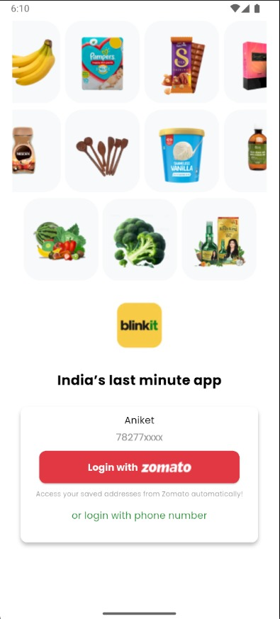
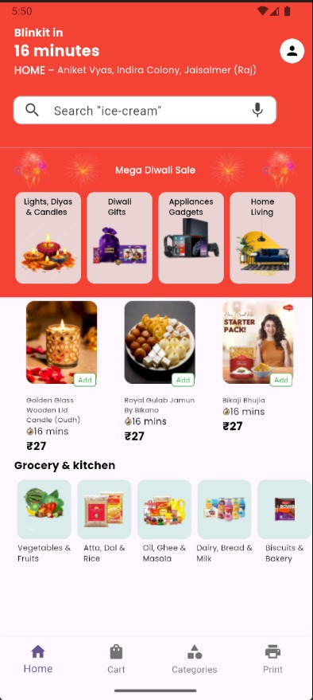
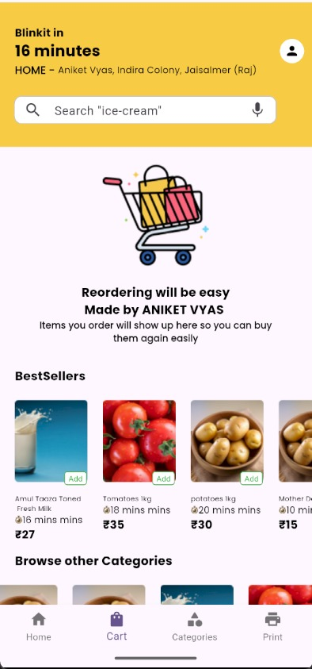
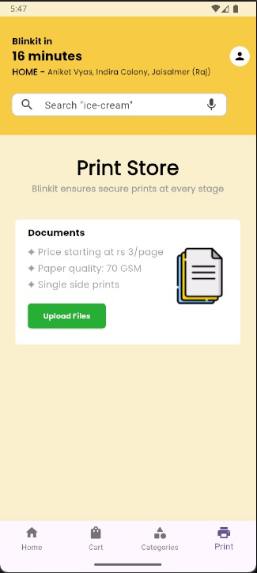

<<<<<<< HEAD
# blinkit_clone_app
## Screenshots

A new Flutter project.

## Getting Started
For help getting started with Flutter development, view the
[online documentation](https://docs.flutter.dev/), which offers tutorials,
samples, guidance on mobile development, and a full API reference.
=======
# Blinkit-clone-
A Flutter-based Blinkit Clone App that replicates the UI and core features of Blinkit. 
● 🛒 Browse products by category  
● 🔍 Search functionality  
● 📦 Add to cart &amp; checkout flow  
● 🎨 Modern, responsive UI with Flutter  
● 🔧 Built for learning and practicing Flutter app development

● Login with zomato Button is also availabe, it would redirect you to the home screen 
>>>>>>> d143360c61a6b2d737c6a8198940c8ba574fe0f2

